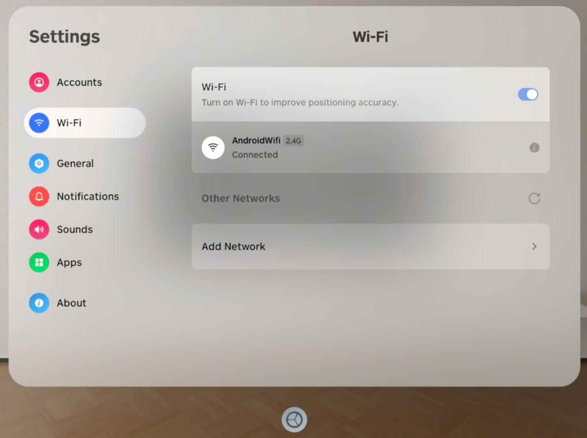
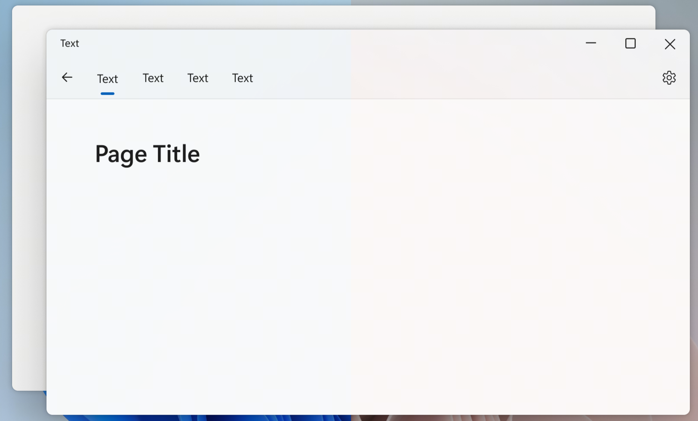
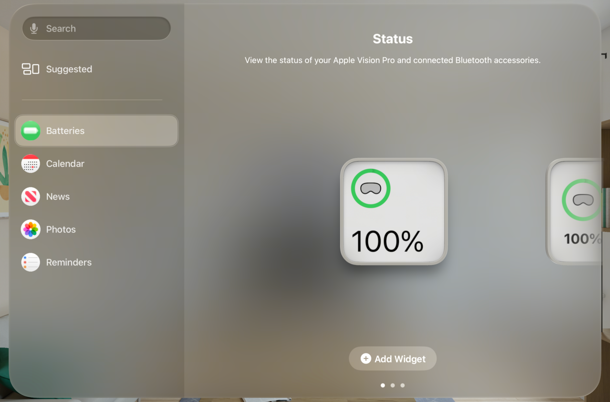

## Introduction

Modern operating systems use materials to communicate depth, layering, presence and mimic real life artifacts. Currently web developers approximate materials with backdrop-filter, images, gradients and semi-transparent backgrounds. But these solutions cannot match dynamic and fluent materials provided by the operating system. This specification proposes a new CSS property `background-material` that renders system defined materials as the background for any element that accepts background-color.

## Research

[PICO OS 6](https://developer.picoxr.com/document/spatial-sdk/glass-effect/) Thin, Regular, Thick, and Thickest material



[Windows 11](https://learn.microsoft.com/en-us/windows/apps/design/signature-experiences/materials) Mica, Mica Alt and Acrylic material



[Android](https://m3.material.io/styles/color/roles) Surface and Surface Container material


[visionOS](https://developer.apple.com/design/human-interface-guidelines/materials) ultraThin, thin, regular and thick material



## Goals

- Declare semantic system materials that are supported across multiple operating systems
- Design a solution that will scale to future OS materials
- Compose cleanly with existing CSS features

## Non-Goals

- Authoring custom materials (shaders, refraction, PBR)

## Syntax

Render a page with ChromeMaterial as the background. Within this page there's a `<main>` element which renders the CanvasMaterial as the background.

```css
html {
  background-material: ChromeMaterial;
  background-color: transparent;
}
main {
  background-material: CanvasMaterial;
}
```

## System Materials

Analogous to CSS `<system-color>`, system materials provide semantic names for default materials on various operating systems. These materials can automatically adapt to different color schemes, themes and color modes. For example, a system which supports both dark and light mode would adapt the system material automatically as the system switches from light to dark. Similarly, when a user opts for reduced transparency the system materials automatically adapt to less transparent materials.

<table header-row="true" col-widths="144,676">
    <tr>
        <td>Abstract material</td>
        <td>Intended use</td>
    </tr>
    <tr>
        <td>ChromeMaterial</td>
        <td>Primary app chrome (title bar / toolbar) where platforms often use a subtle material backdrop.</td>
    </tr>
    <tr>
        <td>CanvasMaterial</td>
        <td>Default opaque background behind primary content.</td>
    </tr>
    <tr>
        <td>PanelMaterial</td>
        <td>Navigation panels and sidebars.</td>
    </tr>
    <tr>
        <td>PopupMaterial</td>
        <td>Menus, popovers, context surfaces, pickers.</td>
    </tr>
    <tr>
        <td>OverlayMaterial</td>
        <td>Transient overlays that need separation (OSD, floating controls, HUD, scrims).</td>
    </tr>
    <tr>
        <td>none</td>
        <td>Default, removes previously defined material definition</td>
    </tr>
</table>

## CSS Interopability

`background-material` is interoperable with existing CSS `background-*` properties. A material is painted as the last background layer, behind `background-color` and `background-image`. Since `background-color` and `background-image` are painted above the material layer, authors need to make those layers transparent when they want the material to be visible. An opaque `background-color` will hide the material.

```css
.panel {
  background-color: transparent;
  background-material: PanelMaterial;
}
```

When defining the `background` CSS property, the `<'background-material'>` component may only be included in the last background layer, similar to `<'background-color'>`. The `background` shorthand resets `background-material` to its initial value, `none`, when no material component is specified.

### Material Detection

Leverage CSS `@supports` to allow developers to set their app's background to transparent when the platform supports materials, and use a different background color if not.

```css
main {
  background-color: Canvas;
}
@supports (background-material: CanvasMaterial) {
  main {
    background-color: transparent;
    background-material: CanvasMaterial;
  }
}
```

## References

- [Microsoft Edge Materials in Web Applications explainer](https://github.com/MicrosoftEdge/MSEdgeExplainers/blob/main/Materials/explainer.md)
- [WebSpatial ](https://webspatial.dev/docs/api/react-sdk/css-api/background-material)[`background-material`](https://webspatial.dev/docs/api/react-sdk/css-api/background-material)[ API](https://webspatial.dev/docs/api/react-sdk/css-api/background-material)
- [CSS Spatial Layout Module Level 1 explainer](https://webkit.github.io/explainers/css-spatial/Overview.html)
- [W3C Explainer Explainer](https://www.w3.org/TR/explainer-explainer/)
- [CSS Backgrounds and Borders Module Level 3](https://www.w3.org/TR/css-backgrounds-3/)
- [Web App Manifest](https://www.w3.org/TR/appmanifest/)
- [WICG](https://wicg.io/)
